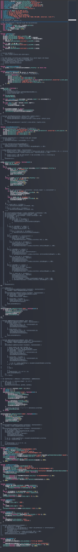

# ADDENDS

On the first page: The gradient and shapes are not part of an image, they were made entirely with CSS! 

On the contact buttons/links: It tries to redirect you to your email client or copies my email for contact, because processing a form properly needs back-end code, which is not allowed to run in GitHub Pages. 

On the footer: The time to develop is the implementation time and includes testing, but it does not include making the mock-up, prototyping, and text writing. The whole process (including repository testing and maintenance) took 2 months and a half, from mid-November (only in the weekends) to the end of January (from mid-December on, in the normal workdays). The first time in my logs that I did something related to this project is from December 24th, 2020; I made a bit of planning only, because I was still on school and was studying other things too. The second time is from October 17th, 2021; when I started doing some things in the project, but I created a 1 year plan about some studies and things I should do to prepare my way for when I finished school and could finally start making this project. I started making it for real around November 24th, 2022.

Extra: It has taken less than 100 hours to develop, probably even the whole process, which is better than what I expected and it could have taken less time to develop if I have not made the custom scroll behavior on the page. Testing things really took a lot of time, unfortunately. 

This shows how long tests took (grayed-out lines are commented code, not working properly code)

I have to be honest, this project needs to be revisited in the future. It is a code mess, even with a nice design, seeing a bit more about UI design and UX I realized that it fails in presentation, and for more that the slideshow effect is nice, it is not how a website is supposed to work. So, at least for now, do not look only at it. \
If you have read until here, and you are interested in me, please take a look in my [Gist](https://gist.github.com/Firespindash) or contact me, I am open for questions.
